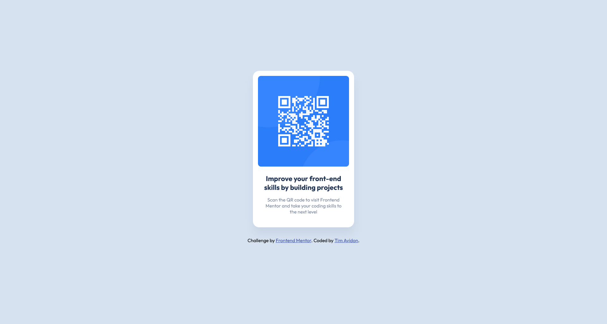

# Frontend Mentor - QR code component solution

This is a solution to the [QR code component challenge on Frontend Mentor](https://www.frontendmentor.io/challenges/qr-code-component-iux_sIO_H). Frontend Mentor challenges help you improve your coding skills by building realistic projects. 

## Table of contents

- [Overview](#overview)
  - [Screenshot](#screenshot)
  - [Links](#links)
- [My process](#my-process)
  - [Built with](#built-with)
  - [Continued development](#continued-development)

## Overview

A QR card project.
the purpuse of the project was to learn CSS to style the content and also the responsive design.

### Screenshot

### Links

- Solution URL: [Github](https://github.com/timavidon/frontend-mentor-c1)
- Live Site URL: [Live Site](https://timavidon.github.io/frontend-mentor-c1/)
- Font: [Outfit](https://fonts.google.com/specimen/Outfit)

## My process

### Built with

- HTML
- CSS 
- colors:
  - Body background: #D5E1EF;
  - QR card background: white;
  - QR heading: hsl(218, 44%, 22%);
  - QR description: hsl(220, 15%, 55%);

### Continued development

I what to improve my responsive design skills and better/optimized code solutions.

